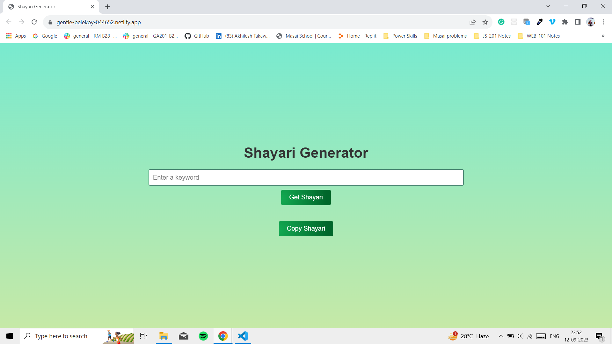
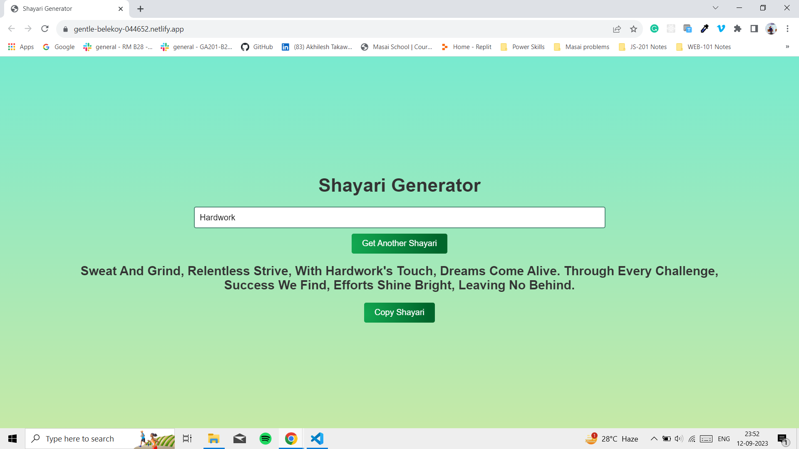
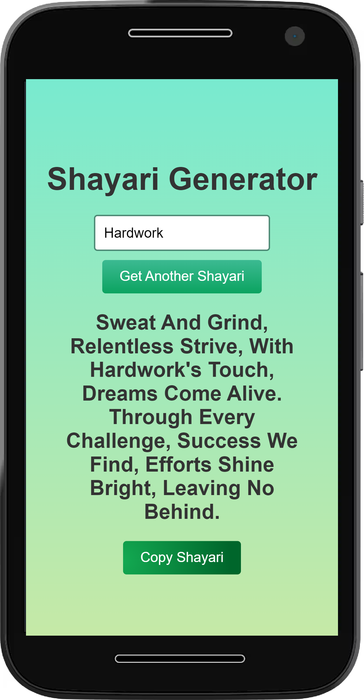

# AI Shayari / quotes Generator

This App is integrated into the ChatGPT and is an AI Shayari generator, where user can write their keyword and get a ready-made Shayari generated.

## Features

- Cross-platform
- Responsive for Mobile,Tablet, Laptop/Desktop

## Tech Stack

**Client:** HTML, CSS, JavaScript

**Server:** NodeJs, Express, Open-ai


## Run Locally

Clone the project

```bash
  https://github.com/dev-akhilesh/AI-Shayari-Generator.git
```

Go to the project directory

```bash
  cd AI-Shayari-Generator
```

Install dependencies

```bash
  npm install
```

Start the server

```bash
  node index.js
```


## Environment Variables

To run this project, you will need to add the following environment variables to your .env file

`PORT`

`OPEN_AI_KEY`


 ## API Reference


#### Get 

```http
  GET /generate-shayari?keyword="value"
```

## Demo
```
https://gentle-belekoy-044652.netlify.app/
```
## Screenshots





<div align="center">
  
</div>


## Author

- [@dev-akhilesh](https://github.com/dev-akhilesh)
